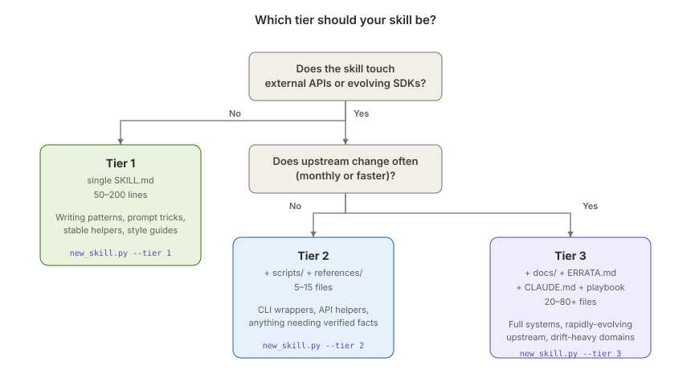
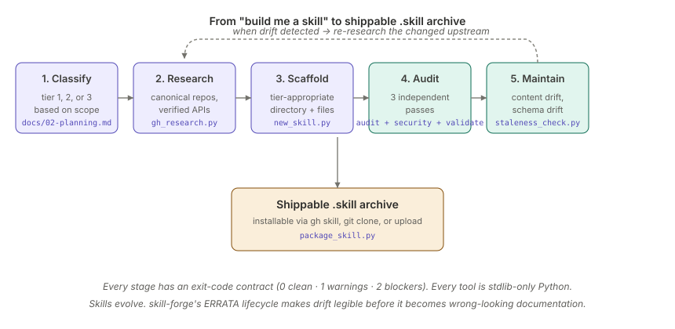
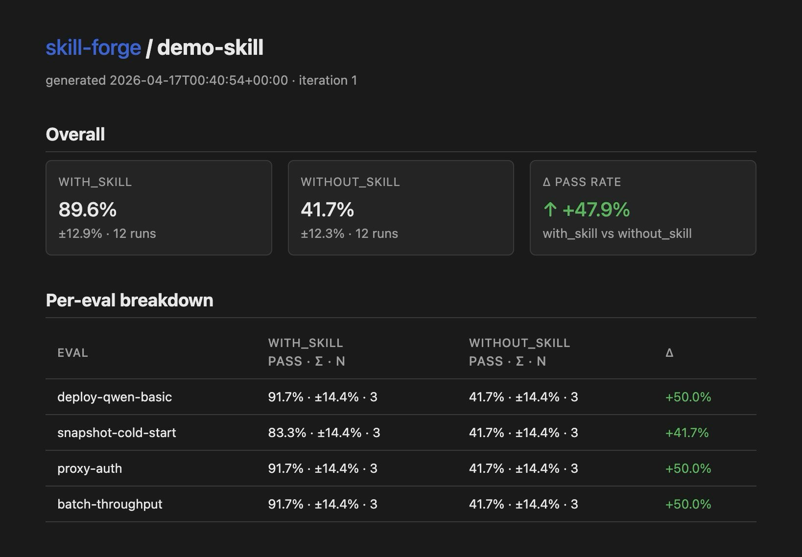
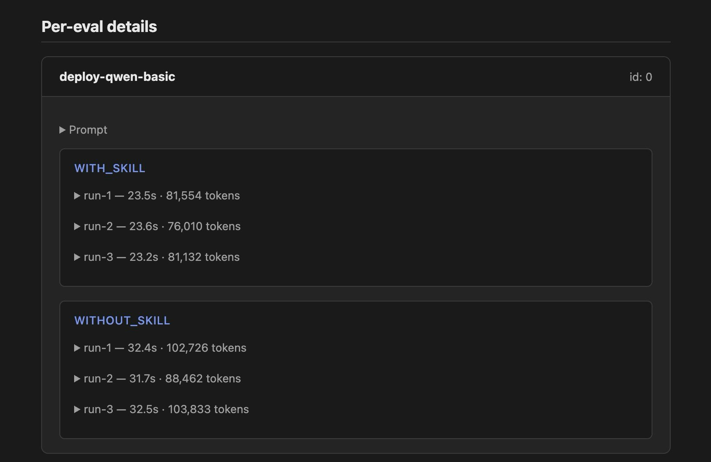

# skill-forge

**An opinionated toolkit for producing Claude skills that actually work on first use.** A meta-skill for creating, auditing, and maintaining [agent skills](https://github.com/anthropics/skills) — with source-first research, anti-slop audits, and drift tracking built in.

> **Most AI-generated skills fail on first use.** Hallucinated API names. Pricing that doesn't match reality. Version pins stale by 18 months. skill-forge catches those before they ship.

- Scaffolds skills at the right complexity tier — no five-paragraph prompt-helpers with `ERRATA.md`, no Modal-deployment skills without one.
- Researches canonical repos at HEAD before generating code, via a stdlib-only GitHub scanner. The repo wins when training data disagrees.
- Audits every draft against ten anti-slop heuristics — fabricated API names, too-round pricing, stale version pins, slop attributions.
- Tracks content drift via schema comparison, complementing `gh skill update`'s tree-SHA version tracking.
- Self-heals via an `active → absorbed → outdated` ERRATA lifecycle that preserves why things changed.
- Runs as a skill itself. It looks like the kind of skill it produces — that is the point.

**Compatible with:** Claude Code · Claude Desktop · claude.ai · VS Code Copilot · Cursor · Codex CLI · Gemini CLI · Kiro · Antigravity — via the standard SKILL.md format.

Built and battle-tested alongside the **[modal-llm-inference](https://github.com/curtismercier/skill-forge/tree/main/modal-llm-inference)** reference skill — 48 files, zero audit warnings, self-healing.

## Quickstart

```bash
# Option A — GitHub CLI (gh v2.90.0+)
gh skill install curtismercier/skill-forge skill-forge

# Option B — Direct clone of just this skill (no extra tools)
git clone --depth=1 --filter=blob:none --sparse \
  https://github.com/curtismercier/skill-forge.git /tmp/sf && \
cd /tmp/sf && git sparse-checkout set skill-forge && \
mv skill-forge ~/.claude/skills/skill-forge && cd - && rm -rf /tmp/sf
```

The `gh skill install` form is the recommended path — it handles per-host directory placement, version pinning, and [provenance tracking](https://github.blog/changelog/2026-04-16-manage-agent-skills-with-github-cli/). The sparse clone is there if you can't use `gh skill` for some reason.

Then ask Claude: *"Build me a skill for deploying vLLM on Modal"* — and watch the workflow below run end-to-end.

## What using it looks like

```
You:    Build me a skill for deploying vLLM on Modal.

Claude: This involves a rapidly-evolving SDK and pricing that drifts
        monthly — that's Tier 3. I'll research the canonical repo first.

        [gh_research.py structure modal-labs/modal-examples]
        [gh_research.py find modal-labs/modal "requires_proxy_auth"]
        [gh_research.py releases modal-labs/modal 3]
        → 47 files read, 6 APIs verified, 1 recent breaking change noted.

        Scaffolding → drafting → auditing...

        [audit_skill.py]     0 flags, 2 warnings (review these quotes)
        [security_scan.py]   0 blockers
        [validate_skill.py]  passes
        [staleness_check.py] FRESH, review in 90 days

        Skill ready at ./modal-llm-inference/.
        48 files. Verification playbook included.
        Package with: python scripts/package_skill.py ./modal-llm-inference/
```

This is what the Modal skill in our reference examples was built with — 48 files, zero audit warnings, self-healing via ERRATA lifecycle.

## Where skill-forge sits

```
┌─────────────────────────────────────────────────────────────┐
│  skill-forge — methodology layer                            │
│  tier ladder · anti-slop audits · content-drift detection   │
│  ERRATA lifecycle · verification playbook · source-first    │
├─────────────────────────────────────────────────────────────┤
│  gh skill (GitHub CLI) — distribution layer (optional)      │
│  install · search · publish · update · tree-SHA versioning  │
├─────────────────────────────────────────────────────────────┤
│  Anthropic's SKILL.md format — what clients actually read   │
│  Claude Code · Claude Desktop · claude.ai · compatible hosts │
└─────────────────────────────────────────────────────────────┘
```

Three layers, each doing one thing. Anthropic's [skills repo](https://github.com/anthropics/skills) documents the format Claude clients read. [GitHub's CLI](https://github.blog/changelog/2026-04-16-manage-agent-skills-with-github-cli/) ships skills between repos if you want it. skill-forge makes them good. **skill-forge does not require `gh skill`** — every tool here works with a plain `git clone`.

See `docs/09-ecosystem.md` for the full breakdown of how skill-forge relates to `gh skill`, Anthropic's own skill-creator, and community alternatives like [FrancyJGLisboa/agent-skill-creator](https://github.com/FrancyJGLisboa/agent-skill-creator) and [jezweb/claude-skills](https://github.com/jezweb/claude-skills).

## What makes skill-forge different

Most skill-creators assume one output shape — a folder with a `SKILL.md`, maybe some scripts. That works for simple skills and over-engineers complex ones. A five-paragraph prompt-helper shouldn't ship with an `ERRATA.md` and a verification playbook. A Modal-deployment skill shouldn't ship *without* one.

Skill-forge classifies every request on a three-tier complexity ladder and scaffolds only what that tier needs:



| Tier | When | Output | Rough size |
|------|------|--------|------------|
| **1 · Single-file** | Writing patterns, prompt tricks, stable helpers | `SKILL.md` only | 50–200 lines |
| **2 · With scripts/references** | CLI wrappers, API helpers, anything needing verified facts or runnable tools | `SKILL.md` + `scripts/` and/or `references/` | 5–15 files |
| **3 · Full system** | Rapidly-evolving upstream, multi-stage workflows, sub-skills, drift tracking | Everything above + `docs/` + `ERRATA.md` + verification playbook | 20–80+ files |

Upgrading from Tier 2 to Tier 3 is easy. Downgrading a bloated Tier 3 to what it should've been is painful. Pick the right rung up front.

> **Want to see all of this end-to-end?** [`docs/10-walkthrough.md`](./docs/10-walkthrough.md) walks through building a real Tier 2 skill (`git-cleanup`) from empty directory through packaging. Every command runnable, every output block real. 30-45 minutes first time, 10 minutes once you know the loop.

### Capability vs. preference — orthogonal to tier

Anthropic's own [March 2026 skill-creator update](https://claude.com/blog/improving-skill-creator-test-measure-and-refine-agent-skills) classifies skills along a second axis that skill-forge's tiers don't address:

- **Capability skills** extend what the base model can do — parsing complex PDFs, running Modal deployments, writing secure code against a specific API. These have expiration dates: as models improve, the skill becomes less necessary (and eventually starts constraining Claude with outdated rules). Evaluate them against the *unassisted* baseline.
- **Preference skills** encode *how* you want work done — formatting meeting notes, writing documentation in your house style, structuring RFCs. These don't expire; they describe taste, not capability.

skill-forge scaffolds both. A Tier 3 capability skill (like `modal-llm-inference`) needs aggressive drift tracking because the underlying API evolves weekly. A Tier 3 preference skill needs drift tracking on *your* style conventions, not external APIs. Same tier, different verification playbook.

## The tools it ships

```
scripts/
├── new_skill.py             scaffold a tier-appropriate skill directory
├── audit_skill.py           anti-slop linter (suspicious numbers, stale markers, slop attributions)
├── security_scan.py         hardcoded secrets + dangerous patterns (separate from audit)
├── staleness_check.py       three layers: review-age, dependency health, schema drift
├── validate_skill.py        hard structural rules (frontmatter, parseability, required files)
├── package_skill.py         zip into a .skill archive (validates first)
├── gh_research.py           stdlib-only GitHub scanner — source-first research before generation
├── aggregate_benchmark.py   roll grading.json files into benchmark.json with stats
├── eval_viewer.py           render benchmark.json to self-contained static HTML
└── vendor/                  pinned external dependencies
    ├── run_loop_hardened.py              skill-forge wrapper with 5 reliability improvements
    └── anthropic_skill_creator/          vendored Anthropic scripts (Apache 2.0)
        ├── utils.py, run_eval.py, improve_description.py,
        │   run_loop.py, generate_report.py
        └── IMPROVEMENTS.md               exact diffs from upstream
```

The `scripts/vendor/anthropic_skill_creator/` subtree is vendored from [anthropics/skills](https://github.com/anthropics/skills/tree/main/skills/skill-creator/scripts) under Apache 2.0 (see `LICENSE-APACHE-ANTHROPIC.txt`). Files are taken verbatim with imports rewritten to be self-contained. `run_loop_hardened.py` is skill-forge's own wrapper adding preflight checks, infra/signal error separation, strict length enforcement, meaningful exit codes, and SIGINT handling — none of which modify the vendored files directly.

Every script exits `0` (clean), `1` (warnings), or `2` (blocking issues), and supports `--json` for CI integration.

## The six patterns, in thirty seconds

1. **Source-first research.** Before generating code for an external API, run `gh_research.py` against the canonical repo. Training-data APIs lie; the repo at HEAD is ground truth. Skills that skip this step hallucinate function names.

2. **Priority-ordered doc discovery.** `CLAUDE.md > AGENTS.md > SKILL.md > llms.txt > llms-full.txt > README.md`. Agent-authored files first because they're written for LLMs to read, not humans.

3. **Three-layer skill structure.** `SKILL.md` routes (decision trees, pointers). `docs/` explains (loaded on demand). `references/` cites (dated, sourced, auditable). `scripts/` runs (tools the agent uses during the session).

4. **ERRATA lifecycle.** `active → absorbed → outdated`. Log drift before silently rewriting; preserves history so the next agent knows whether a "correction" was right or was itself a hallucination.

5. **Verification playbook.** The single most valuable file in a long-lived skill: `docs/00-verification-playbook.md` tells the next agent how to audit every claim. Three-source hierarchy, specific recipes per claim type, one-liner staleness check.

6. **Anti-slop heuristics.** Ten failure modes from real LLM drafts (suspiciously round prices, plausible-but-wrong function names, fabricated HuggingFace IDs, stale version pins, mechanical section structure). `audit_skill.py` catches the mechanical ones; the doc teaches you to spot the rest.

## The workflow



```bash
# 1. Classify
#    Ask the complexity questions. Read docs/02-planning.md if unsure.

# 2. Scaffold
python scripts/new_skill.py --tier 2 --name my-new-skill --domain "Some API"

# 3. Research (mandatory for Tier 2 and 3)
export GITHUB_TOKEN=<your_token>    # lifts rate limit from 60/hr to 5000/hr
python scripts/gh_research.py structure owner/repo
python scripts/gh_research.py find owner/repo "SomeFunction"
python scripts/gh_research.py read owner/repo src/path/to/file.py
python scripts/gh_research.py releases owner/repo 3

# 4. Draft SKILL.md — pushy description (see references/description-tuning.md)

# 5. Audit
python scripts/audit_skill.py ./my-new-skill/          # anti-slop
python scripts/security_scan.py ./my-new-skill/        # secrets + injection
python scripts/validate_skill.py ./my-new-skill/       # structure

# 6. Package
python scripts/package_skill.py ./my-new-skill/

# 7. Maintain
python scripts/staleness_check.py ./my-new-skill/ --check-deps --check-drift
```

## Staleness detection — the clever part

Add a `metadata:` block to any skill's frontmatter, and `staleness_check.py` gives you three layers of drift detection:

```yaml
---
name: my-skill
description: ...
metadata:
  created: 2026-04-16
  last_reviewed: 2026-04-16
  review_interval_days: 90
  dependencies:
    - name: Some API
      url: https://api.example.com/v1/health
  schema_expectations:
    - url: https://api.example.com/v1/items
      method: GET
      expected_keys: [id, name, created_at]
---
```

- **Review tracking** — are we overdue for a manual audit?
- **Dependency health** — do the external URLs we rely on still respond?
- **Schema drift** — does the API still return the shape we expect?

Schema drift is the important one. It catches the case where the API still responds 200, but silently changed its response keys — the kind of break that produces wrong output rather than loud errors. Pattern borrowed from [FrancyJGLisboa/agent-skill-creator](https://github.com/FrancyJGLisboa/agent-skill-creator).

## Install

Three paths, all equivalent. Pick based on what you have installed.

### Option A — GitHub CLI (`gh skill`, v2.90.0+)

```bash
# Install (auto-detects agent host)
gh skill install curtismercier/skill-forge skill-forge

# Or pin to a specific tag for reproducibility
gh skill install curtismercier/skill-forge skill-forge@skill-forge-v1.0.0

# Or target a specific agent host
gh skill install curtismercier/skill-forge skill-forge --agent claude-code
```

`gh skill update` will detect upstream changes via tree-SHA comparison and offer to update. This is the smoothest path if you already have GitHub CLI. Per-skill tags use the `<skill-name>-v<version>` convention.

### Option B — Sparse clone (no extra tools needed)

Because this repo is a monorepo, a full clone would pull every skill. Use `git sparse-checkout` to get just skill-forge:

```bash
# Claude Code + VS Code Copilot
git clone --depth=1 --filter=blob:none --sparse \
  https://github.com/curtismercier/skill-forge.git /tmp/sf && \
cd /tmp/sf && git sparse-checkout set skill-forge && \
mv skill-forge ~/.claude/skills/skill-forge && cd - && rm -rf /tmp/sf

# Universal path (Codex CLI, Gemini CLI, Kiro, Antigravity, and growing)
# Same pattern, different destination:
# mv skill-forge ~/.agents/skills/skill-forge

# Cursor (per-project)
# mv skill-forge .cursor/rules/skill-forge
```

Updating is `git pull` plus re-running `git sparse-checkout set skill-forge` in the clone.

### Option C — Claude Desktop / claude.ai (upload)

Download the `.skill` zip from [Releases](../../releases), then: Settings → Skills → Upload.

---

skill-forge sits alongside Anthropic's [official skill-creator](https://github.com/anthropics/skills/tree/main/skills/skill-creator) — both can be installed at once. Use skill-forge when you want tier-based scaffolding, explicit audit passes, and staleness tracking. Use the official one when you want the supported baseline.

## Why trust this

Every tool in `scripts/` passes against skill-forge itself:

```
validate_skill.py:    ✓ PASS
security_scan.py:     0 block · 0 warn · 0 info
audit_skill.py:       0 flag · 0 warn · 0 info
staleness_check.py:   FRESH — 180 days until next review
```

The first real-world test was auditing a pre-existing Tier 3 skill (`modal-llm-inference`, 48 files). The audit found a genuine bug in the Modal skill (a pricing table had hallucinated GPU rates contradicting the verified reference file) AND surfaced two regex bugs in skill-forge's own scanner (false positives on `sandbox.exec()` method calls and `eval()` in docstring text). Both were fixed, both skills re-audit clean.

That feedback loop is the point. Dogfooding against yourself is insufficient — a skill-forge that only audits skill-forge never discovers its own edge cases. Auditing real skills is what hardens the tools.

## Benchmarks

Running skill-forge's four audits against `modal-llm-inference` (35 files, 8,500+ lines of markdown and Python) on a stock container:

| Tool | Time | Exit | Checks |
|------|------|------|--------|
| `validate_skill.py` | 190 ms | 0 | Frontmatter structure, name format, description length, sub-skill conformance, Python parseability |
| `security_scan.py` | 234 ms | 0 | 12 secret patterns, 8 dangerous-execution patterns, honors `# noqa: security` pragmas |
| `audit_skill.py` | 308 ms | 0 | 10 anti-slop heuristics, honors `<!-- noqa: audit -->` pragmas |
| `staleness_check.py` | 202 ms | 0 | Review age, dependency health, schema drift (all opt-in via frontmatter) |

**Total: under one second to audit a 35-file, 300KB skill.**

### What skill-forge actually caught (from the Modal skill's draft history)

<!-- noqa: audit — table below cites historical defects; $3.50 is a documented bug, not a claim -->
Before skill-forge existed, the first pass of `modal-llm-inference` was drafted from a leading code-generation model and shipped with these defects (all caught by the audit tools or source-first research once built):

| Defect | Type | Heuristic that caught it |
|--------|------|-------------------------|
| H200 GPU price stated as **$3.50/hr** (actual: $4.54/hr) <!-- noqa: audit --> | Hallucinated pricing | `audit_skill.py` round-number flag |
| `container_idle_timeout` (deprecated API) | Stale SDK reference | Caught by `gh_research.py` vs. training-data |
| `vllm.entrypoints.openai.api_server` (deprecated entrypoint) | Stale framework invocation | Caught by `gh_research.py releases` |
| `vllm>=0.6.0` (tags missing since release of 0.19.0) | Stale version pin | `audit_skill.py` version-age flag |
| Fabricated HuggingFace model IDs in examples | Hallucinated identifiers | `audit_skill.py` identifier-shape heuristic |

Each defect would have shipped silently without these tools. **None were caught by general-purpose linters, spell-checkers, or first-pass human review** — they all required domain context or canonical-source cross-checking.

### The eval viewer

When `scripts/aggregate_benchmark.py` rolls per-run `grading.json` files into `benchmark.json`, `scripts/eval_viewer.py` turns that into a self-contained static HTML report. No server, no JS framework — just open the file.



The top section shows overall configuration-level stats with stddev across all runs. The per-eval table below gives you the delta for each individual test case — so you can spot the one eval that's dragging the average down even when the overall delta looks healthy. Everything's a link: click a row, jump to the detail view.



The detail view shows every run for both configurations, with timing and token counts. Click `run-1` / `run-2` to expand the full expectation list with pass/fail marks and evidence for each. This is where you notice things the aggregate hides — like "the with-skill variant passes consistently but takes 50% longer and uses 25% more tokens," which is a real tradeoff to evaluate, not a win to celebrate.

The HTML is one file, zero dependencies. Ship it as a CI artifact, commit it alongside a release tag, or just open it locally.

### How this compares to the rest of the ecosystem

skill-forge does static analysis. Anthropic's recently-released [skill-creator with Eval mode](https://www.anthropic.com/news/claude-skills) does *behavioral* evaluation — defines test cases, runs the skill against them, grades outputs. Community scores on the Tessl registry include [Cisco's software-security skill at 84% overall (1.78× agent improvement)](https://tessl.io/blog/anthropic-brings-evals-to-skill-creator-heres-why-thats-a-big-deal/), ElevenLabs' TTS at 93%, and HuggingFace's tool-builder at 81%.

These are complementary, not competing:

| Concern | skill-forge | Anthropic skill-creator Eval mode |
|---------|-------------|-----------------------------------|
| **What it measures** | Static quality of the skill itself | Behavioral outcomes when agent uses the skill |
| **When it runs** | Pre-commit, CI, on author's machine | Against eval prompts with assertions |
| **Catches** | Hallucinated APIs, stale pins, slop attributions, drift | Task success rate, regression between skill versions |
| **Cost** | Sub-second, no LLM calls | One LLM call per test case × configurations |
| **Stage** | Before the skill ever gets used | After the skill is draft-complete |

A skill that passes skill-forge can still fail behavioral evals. A skill that passes Anthropic's evals can still contain stale pricing that only `audit_skill.py` will notice. Run both.

**One behavioral finding worth knowing:** Anthropic's skill-creator update tested their own six public document-creation skills with a new trigger-optimization loop (60/40 train/test split, up to 5 iterations). **Five of six showed improved trigger accuracy after description optimization.** That's direct empirical support for skill-forge's `references/description-tuning.md` pattern: the frontmatter `description` field does more work than any other 1024 characters in a skill.

### Eval tooling that pairs with Anthropic's skill-creator

skill-forge now ships behavioral-eval tooling that **reuses Anthropic's input schemas** (grading.json, evals.json), verified via round-trip testing:

- `scripts/aggregate_benchmark.py` — reads per-run `grading.json` files (same shape Anthropic's tools produce), emits `benchmark.json` with mean / stddev / min / max per configuration, plus deltas. Stdlib-only.
- `scripts/eval_viewer.py` — renders `benchmark.json` to a self-contained static HTML report. No server, no JS framework, opens with any browser. Works in Cowork / headless CI.
- `evals/agents/` — adapted `grader.md`, `comparator.md`, `analyzer.md` prompt templates, tier-aware and wired to skill-forge's ERRATA lifecycle.
- `evals/schemas/schemas.md` — JSON schema reference with exact interop scope (input shared, output layouts differ).

What we **vendor rather than reimplement:** Anthropic's `run_eval.py`, `run_loop.py`, `improve_description.py`, and `generate_report.py` live at `scripts/vendor/anthropic_skill_creator/` under their original Apache 2.0 license. They shell out to `claude -p` for subagent execution, which is Claude-Code-specific plumbing we shouldn't duplicate. Skill-forge adds `run_loop_hardened.py` — a thin wrapper with preflight checks, strict length enforcement, and meaningful exit codes — without modifying the vendored files, so rebases onto upstream updates stay surgical. See `scripts/vendor/anthropic_skill_creator/IMPROVEMENTS.md` for the exact hardening surface.

## Project structure

```
skill-forge/
├── SKILL.md                              pushy description, decision tree, routes to docs
├── ERRATA.md                             skill-forge's own drift log
├── README.md                             you are here
│
├── docs/
│   ├── 00-verification-playbook.md       ★ how the next agent audits skill-forge itself
│   ├── 01-foundation.md                  what a skill is
│   ├── 02-planning.md                    tier-selection decision tree
│   ├── 03-research-phase.md              mandatory reading for Tier 2/3
│   ├── 05-anti-slop.md                   short pointer to full heuristics
│   ├── 08-maintenance.md                 ERRATA lifecycle, absorption timing
│   ├── 09-ecosystem.md                   where skill-forge sits vs gh skill, the spec, others
│   └── 10-walkthrough.md                 ★ end-to-end: build git-cleanup with every tool
│
├── references/
│   ├── description-tuning.md             the pushy pattern with before/after
│   ├── anti-slop-heuristics.md           10 failure modes from real drafts
│   └── skill-anatomy.md                  what lives where and why
│
├── evals/                                behavioral-eval infrastructure
│   ├── agents/
│   │   ├── grader.md                     subagent prompt for grading assertions
│   │   ├── comparator.md                 subagent prompt for blind A/B
│   │   └── analyzer.md                   subagent prompt for pattern detection
│   └── schemas/
│       └── schemas.md                    JSON schemas (interop with Anthropic)
│
├── scripts/                              (see "The tools it ships" above)
│
├── templates/
│   └── CLAUDE.md.template                scaffolded into Tier 3 skills
│
├── assets/
│   ├── workflow.svg                      pipeline diagram (README)
│   ├── tier-decision.svg                 decision tree (README)
│   └── screenshots/
│       ├── eval-viewer-overall.png       aggregate view shown in README
│       └── eval-viewer-per-eval.png      detail drill-down shown in README
│
└── examples/
    ├── tier1-minimal/                    single-file skill (haiku-style)
    ├── tier2-with-scripts/               scripts + references (gh-research demo)
    └── tier3-reference-excerpt/          pointer to a full Tier 3 example
```

## Contributing

The skill-forge advice is itself subject to drift. When Anthropic updates the skills format, when new community patterns emerge, when upstream tools change — log it in `ERRATA.md` with `active` status before editing the main docs. Keep the history.

Before sending a PR:

```bash
python scripts/validate_skill.py .
python scripts/security_scan.py .
python scripts/audit_skill.py .
```

All three should exit `0`.

## Credits

Patterns borrowed from, and sometimes lightly adapted:

- [anthropics/skills](https://github.com/anthropics/skills) — the canonical SKILL.md format and the reference `skill-creator` implementation
- [`gh skill`](https://github.blog/changelog/2026-04-16-manage-agent-skills-with-github-cli/) — GitHub's CLI for installing and publishing skills (complementary to skill-forge, not required)
- [jezweb/claude-skills](https://github.com/jezweb/claude-skills) — the `ERRATA.md` lifecycle (`active → absorbed → outdated`) and "context window is a public good"
- [FrancyJGLisboa/agent-skill-creator](https://github.com/FrancyJGLisboa/agent-skill-creator) — staleness detection with schema drift, the `~/.agents/skills/` universal-path convention, security scanning as separate pass
- [daymade/claude-code-skills](https://github.com/daymade/claude-code-skills) — "production-hardened, tells you what NOT to try" framing
- [metaskills/skill-builder](https://github.com/metaskills/skill-builder) — sub-agent-to-skill conversion
- [ComposioHQ/awesome-claude-skills](https://github.com/ComposioHQ/awesome-claude-skills), [BehiSecc/awesome-claude-skills](https://github.com/BehiSecc/awesome-claude-skills), [travisvn/awesome-claude-skills](https://github.com/travisvn/awesome-claude-skills) — ecosystem discovery

## License

MIT. Use freely. If skill-forge catches a bug in one of your skills, the ERRATA entry it produced is its own receipt — open an issue and tell us what the heuristic caught so others benefit.

## Feedback

Found a skill-forge pattern that produced a skill you actually wanted to ship? An audit heuristic that fired a false positive? An anti-slop rule we missed? Open an issue. The tools are stdlib-only and the heuristics are in plain Python — patches welcome.

---

> **Future home:** documentation and a living catalog of skill-forge-produced skills will live at **skills.gravicity.ai** *[coming soon]* — part of the [Gravicity](https://gravicity.ai) agent-orchestration ecosystem, alongside SOMA (agent framework), pi-agent, and meetsoma. For now, this repo is the source of truth.
